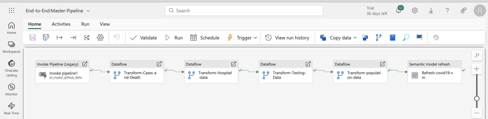
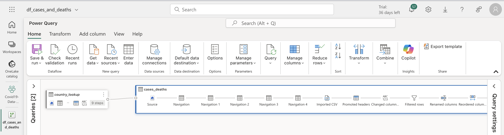
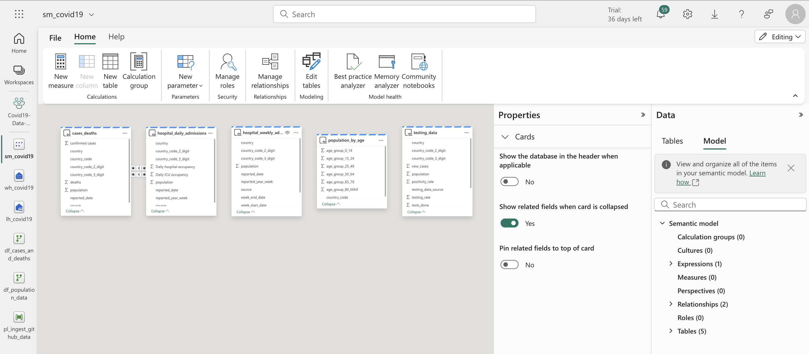
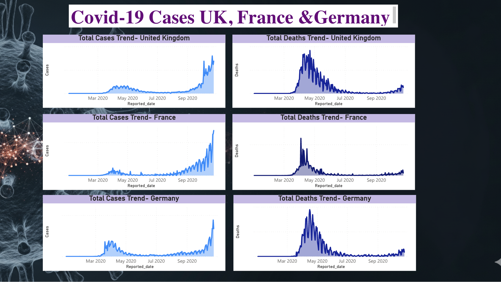
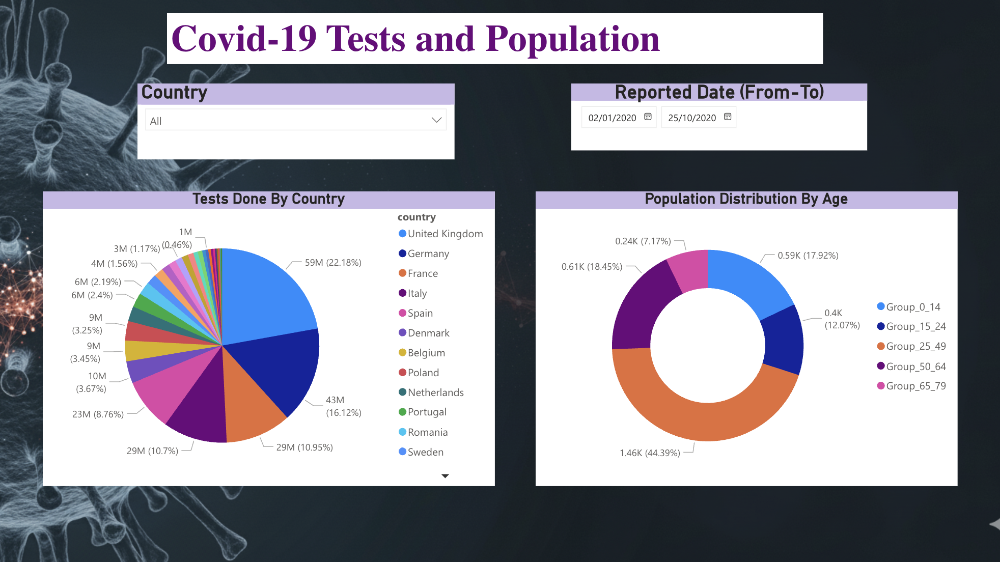

# **COVID-19 Data Project with Microsoft Fabric**

## **Project Overview**

This project focuses on building a data pipeline to ingest, transform, and analyze COVID-19 data using Microsoft Fabric. The goal is to create a robust and scalable solution for tracking key metrics related to the pandemic. The data is sourced from a public GitHub repository, processed through various stages, and ultimately presented in a Power BI report for easy consumption.

## **Architecture**

The project's entire data flow is orchestrated using a **master data pipeline**. This pipeline triggers all subsequent dataflows and processes to ensure a seamless end-to-end flow. The key components of the pipeline are illustrated below.

### **Master Data Pipeline**

The master data pipeline is the central orchestrator of this project. It sequentially triggers the ingestion pipeline, the data transformation dataflows, and the semantic model refresh.

### **Data Ingestion**

Data is pulled from a public GitHub repository and ingested into a Lakehouse.

 This step ensures that the data is copied dynamically from my GitHub repository to Lakehouse files, with help of JSON file uploaded directly to the Lakehouse.

### **Data Transformation**

The data is transformed using multiple dataflows to clean, enrich, and prepare it for analysis. Separate dataflows are used for different data types (e.g., cases, deaths, hospitalizations, testing, population).

 Multiple dataflows are used to optimize performance, rather than relying on a single dataflow for all transformations.

 

 

#### **Dataflows**

All dataflows are organized in a dedicated folder within the workspace for easy management and access.Each dataflow is built in a robust, low-code/no-code environment.

#### **Lakehouse**

The Lakehouse serves as the staging area for all raw data ingested from the source. It stores files in a structured format, ready for the transformation stage.

### **Data Analysis**

* **Warehouse:** Transformed data from the Lakehouse is loaded into a Warehouse, which is optimized for high-performance querying. 

* **Semantic Model:** A semantic model is built on top of the Warehouse data to provide a business-friendly view. This model is refreshed on a schedule to ensure the reports always show the most recent data.  

* **Report:** The final output is a multi-page Power BI report that visualizes key metrics and provides actionable insights.

## **Project Workspace**

The entire project is managed within a single Microsoft Fabric workspace. This provides a centralized location for all the artifacts, including pipelines, dataflows, semantic models, and reports, facilitating collaboration and governance.

## **Reports**

The Power BI report provides a comprehensive view of the COVID-19 data. It is designed with multiple pages to present different aspects of the data clearly and concisely.

### **Report Page 1: Trend**

This page visualizes trends in COVID-19 cases, deaths, hospital occupancy, and ICU occupancy over time. Users can track how these key metrics change by date, identify peaks and declines, and gain insights into the overall impact of the pandemic on healthcare resources.

### **Report Page 2: Trends-Country**

This page highlights trends among various countries, allowing users to compare COVID-19 metrics such as cases, deaths, and hospitalizations across different regions and time periods. Key comparisons include countries like United Kingdom, France, and Germany.

### **Report Page 3: Testing**

This page shows COVID-19 testing statistics and population distribution by age and region.

## **How to Get Started**

To run this project, you will need access to a Microsoft Fabric environment. Once you have access, you can follow these steps:

1. **Clone the Repository:** Clone this repository to your local machine.  
2. **Configure the Pipeline:** Update the pipeline settings to point to your desired GitHub repository.  
3. **Run the Pipeline:** Execute the pipeline to ingest the initial data.  
4. **Open the Report:** Open the Power BI report and connect it to your semantic model.

## **Acknowledgment**

Special thanks to Ramesh Ratnesamy for his guidance and inspiration throughout the project.All the ideas for the project were taken from Azure-Data-Factory-Course by Ramesh Ratnesamy.

## **Contact**

For any queries, please contact me at [puneethkumaramudala7@gmail.com](mailto:puneethkumaramudala7@gmail.com)

